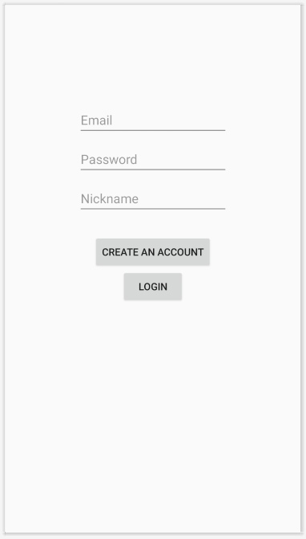
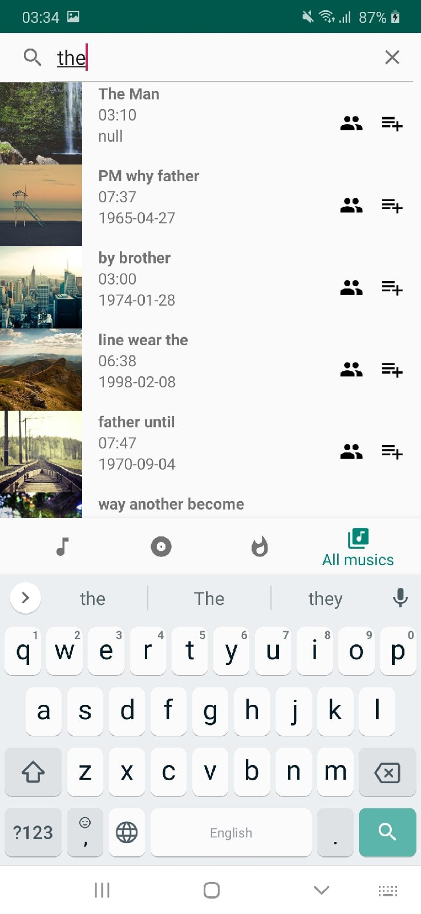
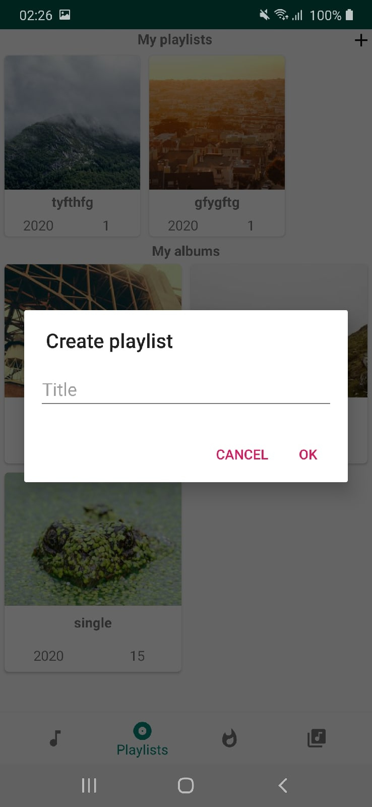
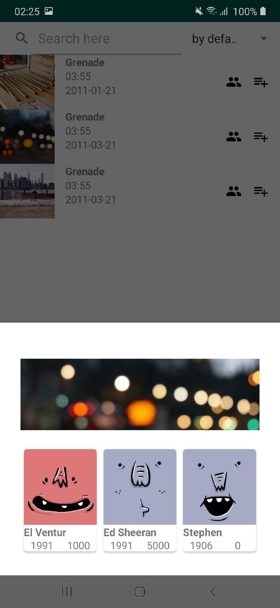
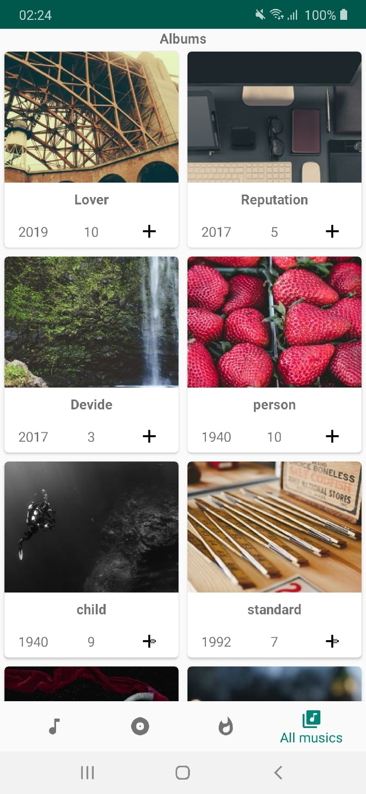
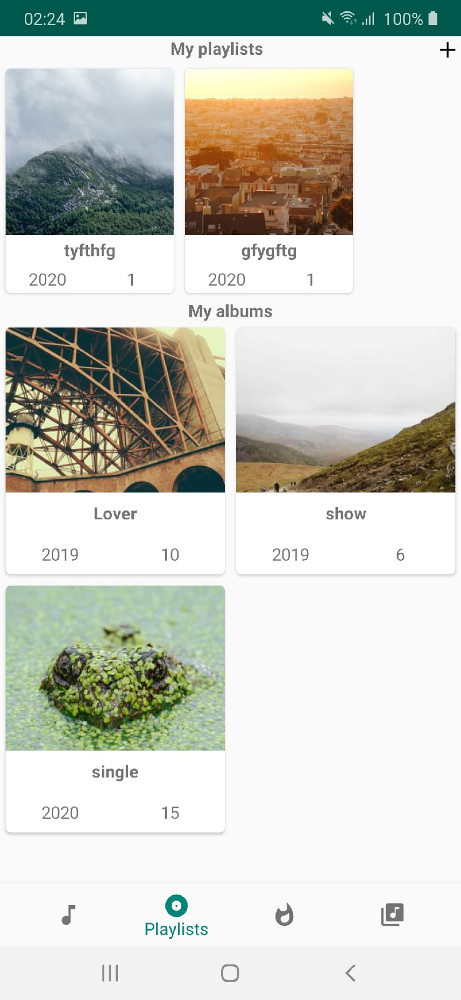

# Music Service App

PostgreSQL -> Valley -> Fragments/Dialogs -> RecycleViews

## 1. Authorization

## 2. Music list search

## 3. Create new playlist

## 4. Check authors of the music

## 5. Main interface of the app (albums, playlists)

